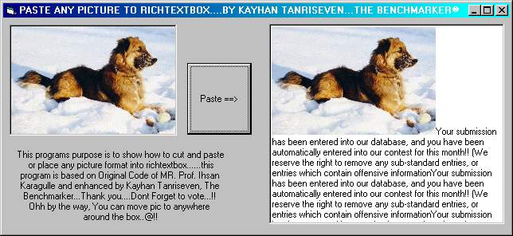



## ADD PICTURE TO RICHTEXTBOX\!\!

### Description

With the code you can place any picture any where on the RICHTEXTBOX....this is a really great application for who likes to develop word programs with richtextbox control..
 
### More Info
 

             |
---                |---
**Submitted On**   |2000-10-01 15:37:26
**By**             |[VbNick](https://github.com/Planet-Source-Code/PSCIndex/blob/master/ByAuthor/vbnick.md)
**Level**          |Intermediate
**User Rating**    |4.5 (36 globes from 8 users)
**Compatibility**  |VB 5\.0, VB 6\.0
**Category**       |[Custom Controls/ Forms/  Menus](https://github.com/Planet-Source-Code/PSCIndex/blob/master/ByCategory/custom-controls-forms-menus__1-4.md)
**World**          |[Visual Basic](https://github.com/Planet-Source-Code/PSCIndex/blob/master/ByWorld/visual-basic.md)
**Archive File**   |[CODE\_UPLOAD103361012000\.zip](https://github.com/Planet-Source-Code/vbnick-add-picture-to-richtextbox__1-11815/archive/master.zip)

### API Declarations

in the zip

